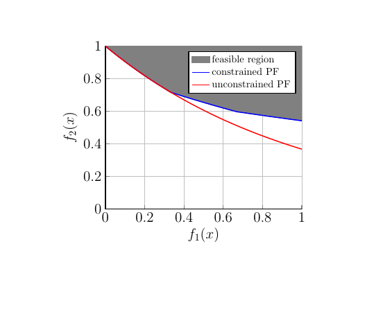
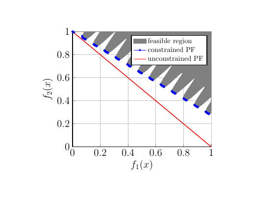
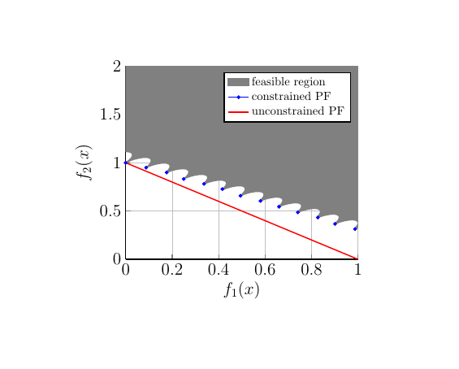
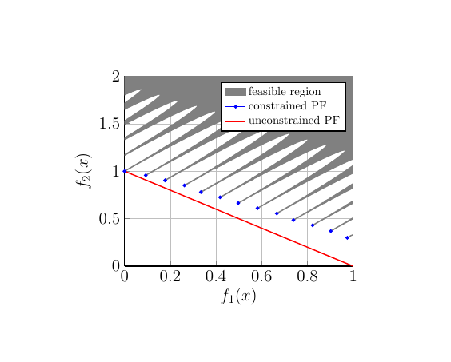
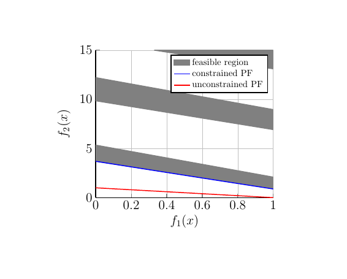
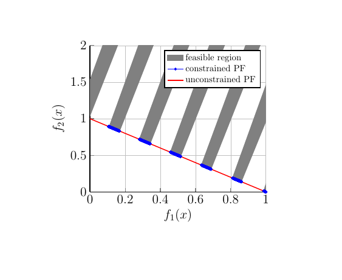
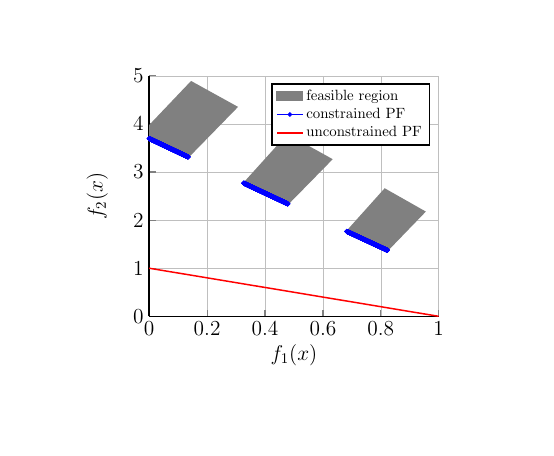

===============  
CTP
===============
CTP was raised in 2001. The constraints make some part of the unconstrained Pareto-optimal region is infeasible. In this way the overall Pareto-optimal front will constitute with some unconstrained Pareto-optimal region and some constraint boundaries.

CTP test problem set is only a double objective problem, which can not be extended to high dimensions. At the same time, its constraints setting is relatively simple and the range of objective values is small, which will cause most algorithms will not have too bad performance on this test problem set.

Now, we give the details of the test problem set.

CTP1
----------------
CTP1 is a continuous two-dimensional opitmization problem. The Pareto-optimal front makes up with some part of unconstrained Pareto-optimal region and some part of the constraint boundaries.

the form of CTP1
~~~~~~~~~~~~~~~~~~

the first objective value :math:`f_1(x_I)` and the function :math:`g(x_{II})` can be any multi-variable functions.

*the formula of the second objective value:*

  .. math::
    f_2(x)=g(x_{II})e^{-f_1(x_I)/g(x_{II})}

*the formula of the constraint:*

  .. math::
    C_j(x)=f_2(x) - a_je^{-b_jf_1(x_I)}

procedure for calculating :math:`a_j` and :math:`b_j`
~~~~~~~~~~~~~~~~~~~~~~~~~~~~~~~~~~~~~~~~~~~~~~~~~~~~~~~

**STEP 1**   Set j = 0, :math:`a_j=b_j=1`; :math:`\Delta=\frac{1}{J+1}` and :math:`\alpha=\Delta`

**STEP 2**   Calculate :math:`\beta=a_{j}e^{-b_j\alpha}`

  .. math::
    a_{j+1}=\frac{a_j+\beta}{2} 

  .. math::
    b_{j+1}=-\frac{1}{\alpha}ln(\frac{\beta}{a_{j+1}})  

           

Increment :math:`\alpha=\alpha+\Delta` and :math:`j=j+1`.

**STEP 3**   if :math:`j<J`, go to Step 2. Otherwise, the process is complete.

For two constriants (J=2), the above procedure finds the following parameter values:

  .. math::
    a_1 = 0.858, \ a_2 = 0.728, \ b_1 = 0.541, \ b_2 = 295

Code
~~~~~

.. code-block:: c
   
    void ctp1 (individual_real *ind) {
        double m;
        double *xreal, *obj;
        double g,h,f1=0,f2=0;
        int i;

        obj = ind->obj;
        xreal = ind->xreal;
        for (i = 1;i < number_objective;i++)
        {
            f1 += pow(xreal[i],2.0);
            f2 += xreal[i];
        }
        obj[0]=xreal[0];//f1(x)
        g=11+f1-10*cos(2*PI*f2);
        h=exp(-obj[0]/g);
        obj[1] = g*h;//f2(x)

        //the constraints: 
        int j,J;
        J=2;
        double a[J+1],b[J+1],C[J+1];
        double alfa,beta,delta;
        double a1, b1, a2, b2, C1, C2;
        delta=1.0/(J+1.0);
        alfa=delta;
        for (j=0;j<J;j++)
        {
            if(j==0)
            {
                a[j]=1.0;
                b[j]=1.0;
            }
            beta=a[j]*exp(-b[j]*alfa);
            a[j+1]=(a[j]+beta)/2.0;
            b[j+1]=-1.0*log(beta/a[j+1])/alfa;
            alfa=alfa+delta;
        }

        /*a1=0.858;
          a2=0.728;
          b1=0.541;
          b2=0.295;
        */
        ind->cv=0;
        for (j=0;j<J;j++)
        {
            C[j+1]=obj[1]-a[j+1]*exp(-b[j+1]*obj[0]);
            if(C[j+1]>0||C[j+1]==0)
                m=0;
            else
                m=C[j+1];
            ind->cv += m;
        }
    }

objective space view
~~~~~~~~~~~~~~~~~~~~~~~~~~

CTP2
----------------
CTP2 is a discrete two-dimensional opitmization problem. The Pareto-optimal front makes up with some part of constrained Pareto-optimal region.

the form of CTP2
~~~~~~~~~~~~~~~~~~

the first objective value :math:`f_1(x_I)` and the function :math:`g(x_{II})` can be any multi-variable functions.

*the formula of the first objective value:*

  .. math::
    f_1(x)=x_1

*the formula of the second objective value:*

  .. math::
    f_2(x)=g(x)(1-f_1(x)/g(x))

*the formula of the constraint:*

  .. math::
    C(x)\equiv cos(\theta)[f_2(x) - e] - sin(\theta)f_1(x) \geq a|sin\{{b*\pi[sin(\theta)(f_2(x) - e) + cos(\theta)f_1(x)]^c\}}|^d 

parameter settings
~~~~~~~~~~~~~~~~~~~~~~~~~~~~~~~~~~~~~~~~~~~~~~~~~~~~~~~

  .. math::
    \theta = -0.2\pi, \ a = 0.2, \ b = 10, \ c = 1, \ d = 6, \ e = 1

Code
~~~~~

.. code-block:: c
   
    void ctp2 (individual_real *ind){
        double m;
        double *xreal, *obj;
        double g,h,f=0;
        int i;

        obj = ind->obj;
        xreal = ind->xreal;
        for(i=1;i<number_objective;i++)
        {
            f += xreal[i];
        }
        g=1+f;
        obj[0] = xreal[0];  //f1(x)
        h=1-obj[0]/g;       
        obj[1] = g*h;       //f2(x)

        //the constraint:
        double C, theta, a,b,c,d,e;
        theta=-0.2*PI;
        a=0.2;
        b=10;
        c=1;
        d=6;
        e=1;
        C=cos(theta)*(obj[1]-e)-sin(theta)*obj[0]-a*pow(sin(b*PI*pow(sin(theta)*(obj[1]-e)+cos(theta)*obj[0],c)),d);
        if(C<0)
        {
            m=C;
        }
        else
        {
            m=0;
        }
        ind->cv=m;
    }

objective space view
~~~~~~~~~~~~~~~~~~~~~~~~~~

CTP3
----------------
CTP3 is a discrete two-dimensional opitmization problem. The Pareto-optimal front makes up with some points of constrained Pareto-optimal region.

The objectives' formula and the constriant's formula are the same as the form of CTP2. It just has a little change about the parameter settings of constraint. 

parameter settings
~~~~~~~~~~~~~~~~~~~~~~~~~~~~~~~~~~~~~~~~~~~~~~~~~~~~~~~

  .. math::
    \theta = -0.2\pi, \ a = 0.1, \ b = 10, \ c = 1, \ d = 0.5, \ e = 1

Code
~~~~~

.. code-block:: c
   
    void ctp3 (individual_real *ind){
        double m;
        double *xreal, *obj;
        double g,h,f=0;
        int i;

        obj = ind->obj;
        xreal = ind->xreal;
        for(i=1;i<number_objective;i++)
        {
            f += xreal[i];
        }
        g=1+f;
        obj[0] = xreal[0];  //f1(x)
        h=1-obj[0]/g;       
        obj[1] = g*h;       //f2(x)

        //the constraint:
        double C, theta, a,b,c,d,e;
        theta=-0.2*PI;
        a=0.1;
        b=10;
        c=1;
        d=0.5;
        e=1;
        C=cos(theta)*(obj[1]-e)-sin(theta)*obj[0]-a*pow(fabs(sin(b*PI*pow(sin(theta)*(obj[1]-e)+cos(theta)*obj[0],c))),d);
        if(C<0)
        {
            m=C;
        }
        else
        {
            m=0;
        }
        ind->cv=m;
    }

objective space view
~~~~~~~~~~~~~~~~~~~~~~~~~~

CTP4
----------------
CTP4 is a discrete two-dimensional opitmization problem. The Pareto-optimal front makes up with some points of constrained Pareto-optimal region.

The objectives' formula and the constriant's formula are the same as the form of CTP2. It just has a little change about the parameter settings of constraint. 

parameter settings
~~~~~~~~~~~~~~~~~~~~~~~~~~~~~~~~~~~~~~~~~~~~~~~~~~~~~~~

  .. math::
    \theta = -0.2\pi, \ a = 0.75, \ b = 10, \ c = 1, \ d = 0.5, \ e = 1

Code
~~~~~

.. code-block:: c
   
    void ctp4 (individual_real *ind){
        double m;
        double *xreal, *obj;
        double g,h,f=0;
        int i;

        obj = ind->obj;
        xreal = ind->xreal;
        for(i=1;i<number_objective;i++)
        {
            f += xreal[i];
        }
        g=1+f;
        obj[0] = xreal[0];  //f1(x)
        h=1-obj[0]/g;       
        obj[1] = g*h;       //f2(x)

        //the constraint:
        double C, theta, a,b,c,d,e;
        theta=-0.2*PI;
        a=0.75;
        b=10;
        c=1;
        d=0.5;
        e=1;
        C=cos(theta)*(obj[1]-e)-sin(theta)*obj[0]-a*pow(fabs(sin(b*PI*pow(sin(theta)*(obj[1]-e)+cos(theta)*obj[0],c))),d);
        if(C<0)
        {
            m=C;
        }
        else
        {
            m=0;
        }
        ind->cv=m;
    }

objective space view
~~~~~~~~~~~~~~~~~~~~~~~~~~

CTP5
----------------
CTP5 is a discrete two-dimensional opitmization problem. The Pareto-optimal front makes up with some points of constrained Pareto-optimal region.

The objectives' formula and the constriant's formula are the same as the form of CTP2. It just has a little change about the parameter settings of constraint. 

parameter settings
~~~~~~~~~~~~~~~~~~~~~~~~~~~~~~~~~~~~~~~~~~~~~~~~~~~~~~~

  .. math::
    \theta = -0.2\pi, \ a = 0.1, \ b = 10, \ c = 2, \ d = 0.5, \ e = 1

Code
~~~~~

.. code-block:: c
   
    void ctp5 (individual_real *ind){
        double m;
        double *xreal, *obj;
        double g,h,f=0;
        int i;

        obj = ind->obj;
        xreal = ind->xreal;
        for(i=1;i<number_objective;i++)
        {
            f += xreal[i];
        }
        g=1+f;
        obj[0] = xreal[0];  //f1(x)
        h=1-obj[0]/g;       
        obj[1] = g*h;       //f2(x)

        //the constraint:
        double C, theta, a,b,c,d,e;
        theta=-0.2*PI;
        a=0.1;
        b=10;
        c=2;
        d=0.5;
        e=1;
        C=cos(theta)*(obj[1]-e)-sin(theta)*obj[0]-a*pow(fabs(sin(b*PI*pow(sin(theta)*(obj[1]-e)+cos(theta)*obj[0],c))),d);
        if(C<0)
        {
            m=C;
        }
        else
        {
            m=0;
        }
        ind->cv=m;
    }

objective space view
~~~~~~~~~~~~~~~~~~~~~~~~~~

.. figure:: ../_static/ctp_new/ctp5.png

CTP6
----------------
CTP6 is a discrete two-dimensional opitmization problem. The Pareto-optimal front makes up with some parts of constrained Pareto-optimal region.

The objectives' formula and the constriant's formula are the same as the form of CTP2. It just has a little change about the parameter settings of constraint. 

parameter settings
~~~~~~~~~~~~~~~~~~~~~~~~~~~~~~~~~~~~~~~~~~~~~~~~~~~~~~~

  .. math::
    \theta = -0.1\pi, \ a = 40, \ b = 0.5, \ c = 1, \ d = 2, \ e = -2

Code
~~~~~

.. code-block:: c
   
    void ctp6 (individual_real *ind){
        double m;
        double *xreal, *obj;
        double g,h,f=0;
        int i;

        obj = ind->obj;
        xreal = ind->xreal;
        for(i=1;i<number_objective;i++)
        {
            f += xreal[i];
        }
        g=1+f*5;
        obj[0] = xreal[0];  //f1(x)
        h=1-obj[0]/g;       
        obj[1] = g*h;       //f2(x)

        //the constraint:
        double C, theta, a,b,c,d,e;
        theta=-0.1*PI;
        a=40;
        b=0.5;
        c=1;
        d=2;
        e=-2;
        C=cos(theta)*(obj[1]-e)-sin(theta)*obj[0]-a*pow(fabs(sin(b*PI*pow(sin(theta)*(obj[1]-e)+cos(theta)*obj[0],c))),d);
        if(C<0)
        {
            m=C;
        }
        else
        {
            m=0;
        }
        ind->cv=m;
    }

objective space view
~~~~~~~~~~~~~~~~~~~~~~~~~~

CTP7
----------------
CTP7 is a discrete two-dimensional opitmization problem. The Pareto-optimal front makes up with some parts of constrained Pareto-optimal region.

The objectives' formula and the constriant's formula are the same as the form of CTP2. It just has a little change about the parameter settings of constraint. 

parameter settings
~~~~~~~~~~~~~~~~~~~~~~~~~~~~~~~~~~~~~~~~~~~~~~~~~~~~~~~

  .. math::
    \theta = -0.05\pi, \ a = 40, \ b = 5, \ c = 1, \ d = 6, \ e = 0

Code
~~~~~

.. code-block:: c
   
    void ctp7 (individual_real *ind){
        double m1, m2;
        double *xreal, *obj;
        double g,h,f=0;
        int i;

        obj = ind->obj;
        xreal = ind->xreal;
        for(i=1;i<number_objective;i++)
        {
            f += xreal[i];
        }
        g=1+f;
        obj[0] = xreal[0];  //f1(x)
        h=1-obj[0]/g;       
        obj[1] = g*h;       //f2(x)

        //the constraint:
        double C, theta, a,b,c,d,e;
        theta=-0.05*PI;
        a=40;
        b=5;
        c=1;
        d=6;
        e=0;
        C=cos(theta)*(obj[1]-e)-sin(theta)*obj[0]-a*pow(fabs(sin(b*PI*pow(sin(theta)*(obj[1]-e)+cos(theta)*obj[0],c))),d);

        if(C<0)
        {
            m1=C;
        }
        else
        {
            m1=0;
        }

        m2 = obj[1] - 1 + obj[0];
        if(m2 > 0)
            m2 = 0;
        else
            m2 = -1 + m2;

        ind->cv=m1 + m2;
    }

objective space view
~~~~~~~~~~~~~~~~~~~~~~~~~~

CTP8
----------------
CTP8 is a discrete two-dimensional opitmization problem. The Pareto-optimal front makes up with some parts of constrained Pareto-optimal region.

The objectives' formula and the constriant's formula are the same as the form of CTP2. It just has a little change about the parameter settings of constraints. Meanwhile, it has two constraints. 

parameter settings
~~~~~~~~~~~~~~~~~~~~~~~~~~~~~~~~~~~~~~~~~~~~~~~~~~~~~~~

  .. math::
    \theta1 = 0.1\pi, \ a1 = 40, \ b1 = 0.5, \ c1 = 1, \ d1 = 2, \ e1 = -2\\
    \theta2 = -0.05\pi, \ a2 = 40, \ b2 = 2, \ c2 = 1, \ d2 = 6, \ e2 = 0

Code
~~~~~

.. code-block:: c
   
    void ctp8 (individual_real *ind){
        double m;
        double *xreal, *obj;
        double g,h,f=0;
        int i;

        obj = ind->obj;
        xreal = ind->xreal;
        for(i=1;i<number_objective;i++)
        {
            f += xreal[i];
        }
        g=1+f*5;
        obj[0] = xreal[0];  //f1(x)
        h=1-obj[0]/g;       
        obj[1] = g*h;       //f2(x)

        //the constraints:
        double C1, theta1, a1,b1,c1,d1,e1;
        double C2, theta2, a2,b2,c2,d2,e2;

        theta1=0.1*PI;
        a1=40;
        b1=0.5;
        c1=1;
        d1=2;
        e1=-2;
        C1=cos(theta1)*(obj[1]-e1)-sin(theta1)*obj[0]-a1*pow(fabs(sin(b1*PI*pow(sin(theta1)*(obj[1]-e1)+cos(theta1)*obj[0],c1))),d1);
        
        theta2=-0.05*PI;
        a2=40;
        b2=2;
        c2=1;
        d2=6;
        e2=0;
        C2=cos(theta2)*(obj[1]-e2)-sin(theta2)*obj[0]-a2*pow(fabs(sin(b2*PI*pow(sin(theta2)*(obj[1]-e2)+cos(theta2)*obj[0],c2))),d2);

        if(C1>0 || C1==0)
        {
            m=0;
        }
        else
        {
            m=C1;
        }
        if(C2>0 || C2==0)
        {
            ind->cv = m;
        }
        else
        {
            ind>cv = m + C2;
        }
    }

objective space view
~~~~~~~~~~~~~~~~~~~~~~~~~~

