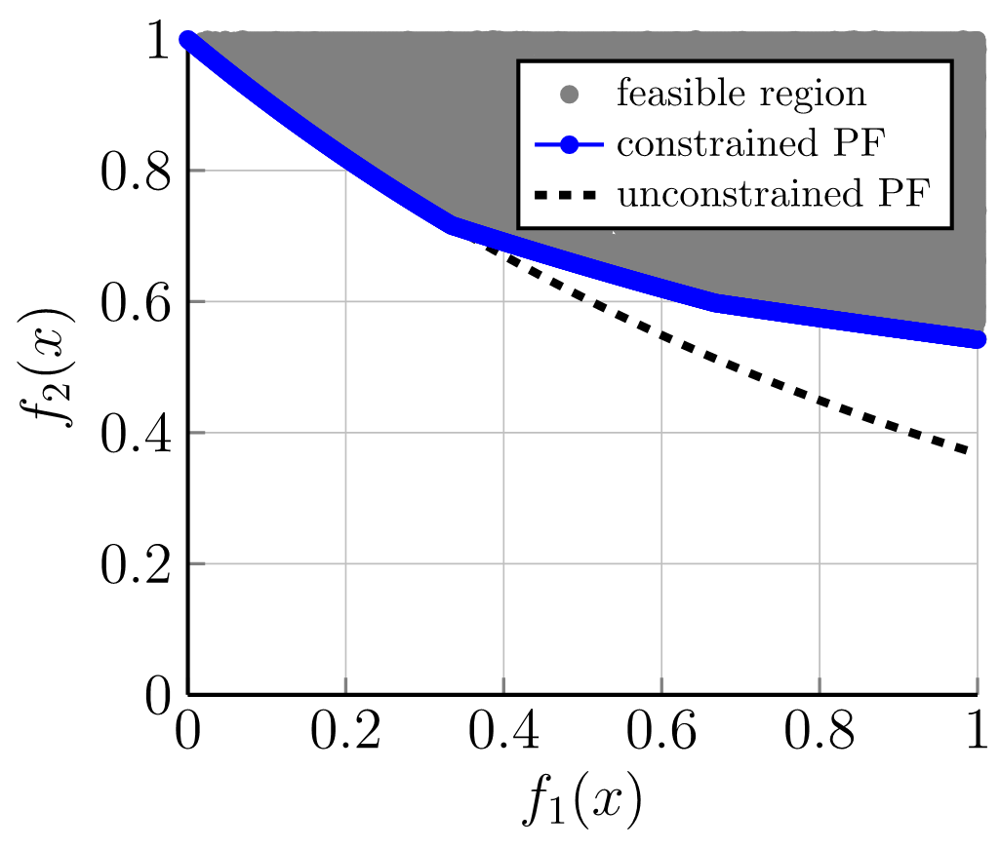

===============  
CTP
===============
CTP was raised in 2001. The constraints make some part of the unconstrained Pareto-optimal region is infeasible. In this way the overall Pareto-optimal front will constitute with some unconstrained Pareto-optimal region and some constraint boundaries.

CTP test problem set is only a double objective problem, which can not be extended to high dimensions. At the same time, its constraints setting is relatively simple and the range of objective values is small, which will cause most algorithms will not have too bad performance on this test problem set.

Now, we give the details of the test problem set.

CTP1
----------------
CTP1 is a continuous two-dimensional opitmization problem. The Pareto-optimal front makes up with some part of unconstrained Pareto-optimal region and some part of the constraint boundaries.

the form of CTP1
~~~~~~~~~~~~~~~~~~

the first objective value :math:`f_1(x_I)` and the function :math:`g(x_{II})` can be any multi-variable functions.

*the formula of the second objective value:*

  .. math::
    f_2(x)=g(x_{II})e^{-f_1(x_I)/g(x_{II})}

*the formula of the constraint:*

  .. math::
    C_j(x)=f_2(x) - a_je^{-b_jf_1(x_I)}

procedure for calculating :math:`a_j` and :math:`b_j`
~~~~~~~~~~~~~~~~~~~~~~~~~~~~~~~~~~~~~~~~~~~~~~~~~~~~~~~

**STEP 1**   Set j = 0, :math:`a_j=b_j=1`; :math:`\Delta=\frac{1}{J+1}` and :math:`\alpha=\Delta`

**STEP 2**   Calculate :math:`\beta=a_{j}e^{-b_j\alpha}`

  .. math::
    a_{j+1}=\frac{a_j+\beta}{2} 

  .. math::
    b_{j+1}=-\frac{1}{\alpha}ln(\frac{\beta}{a_{j+1}})  

           

Increment :math:`\alpha=\alpha+\Delta` and :math:`j=j+1`.

**STEP 3**   if :math:`j<J`, go to Step 2. Otherwise, the process is complete.

For two constriants (J=2), the above procedure finds the following parameter values:

  .. math::
    a_1 = 0.858,  a_2 = 0.728,  b_1 = 0.541,  b_2 = 295

Code
~~~~~

.. tabs::
   .. code-tab:: r C
    
        void ctp1 (individual_real *ind) {
        double m;
        double *xreal, *obj;
        double g,h,f1=0,f2=0;
        int i;

        obj = ind->obj;
        xreal = ind->xreal;
        for (i = 1;i < number_objective;i++)
        {
            f1 += pow(xreal[i],2.0);
            f2 += xreal[i];
        }
        obj[0]=xreal[0];//f1(x)
        g=11+f1-10*cos(2*PI*f2);
        h=exp(-obj[0]/g);
        obj[1] = g*h;//f2(x)

        //the constraint numbers is J;
        int j,J;
        J=2;
        double a[J+1],b[J+1],C[J+1];
        double alfa,beta,delta;
        double a1, b1, a2, b2, C1, C2;
        delta=1.0/(J+1.0);
        alfa=delta;
        for (j=0;j<J;j++)
        {
            if(j==0)
            {
                a[j]=1.0;
                b[j]=1.0;
            }
            beta=a[j]*exp(-b[j]*alfa);
            a[j+1]=(a[j]+beta)/2.0;
            b[j+1]=-1.0*log(beta/a[j+1])/alfa;
            alfa=alfa+delta;
        }

        /*a1=0.858;
          a2=0.728;
          b1=0.541;
          b2=0.295;
        */
        ind->cv=0;
        for (j=0;j<J;j++)
        {
            C[j+1]=obj[1]-a[j+1]*exp(-b[j+1]*obj[0]);
            if(C[j+1]>0||C[j+1]==0)
                m=0;
            else
                m=C[j+1];
            ind->cv += m;
        }
    }

objective space view
~~~~~~~~~~~~~~~~~~~~~~~~~~

CTP2
----------------
Subtitles are set with '-' and are required to have the same length 
of the subtitle itself, just like titles.

Lists can be unnumbered like:

 * Item Foo
 * Item Bar

Or automatically numbered:

 #. Item 1
 #. Item 2

CTP3
----------------
Subtitles are set with '-' and are required to have the same length 
of the subtitle itself, just like titles.

Lists can be unnumbered like:

 * Item Foo
 * Item Bar

Or automatically numbered:

 #. Item 1
 #. Item 2

CTP4
----------------
Subtitles are set with '-' and are required to have the same length 
of the subtitle itself, just like titles.

Lists can be unnumbered like:

 * Item Foo
 * Item Bar

Or automatically numbered:

 #. Item 1
 #. Item 2

CTP5
----------------
Subtitles are set with '-' and are required to have the same length 
of the subtitle itself, just like titles.

Lists can be unnumbered like:

 * Item Foo
 * Item Bar

Or automatically numbered:

 #. Item 1
 #. Item 2

CTP6
----------------
Subtitles are set with '-' and are required to have the same length 
of the subtitle itself, just like titles.

Lists can be unnumbered like:

 * Item Foo
 * Item Bar

Or automatically numbered:

 #. Item 1
 #. Item 2

CTP7
----------------
Subtitles are set with '-' and are required to have the same length 
of the subtitle itself, just like titles.

Lists can be unnumbered like:

 * Item Foo
 * Item Bar

Or automatically numbered:

 #. Item 1
 #. Item 2

CTP8
----------------
Subtitles are set with '-' and are required to have the same length 
of the subtitle itself, just like titles.

Lists can be unnumbered like:

 * Item Foo
 * Item Bar

Or automatically numbered:

 #. Item 1
 #. Item 2

Inline Markup
-------------
Words can have *emphasis in italics* or be **bold** and you can define
code samples with back quotes, like when you talk about a command: ``sudo`` 
gives you super user powers!

