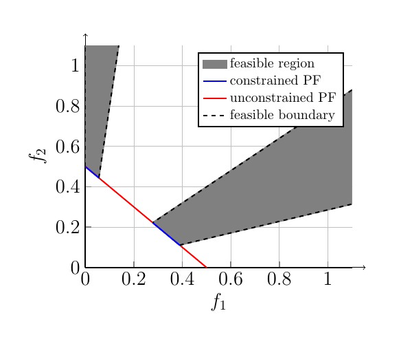
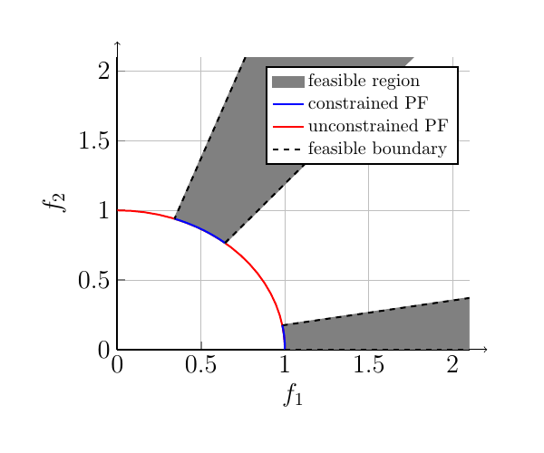
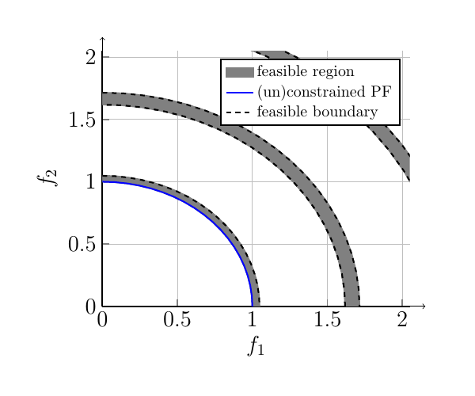
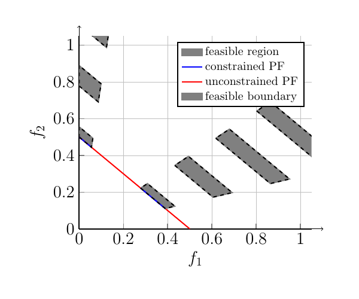
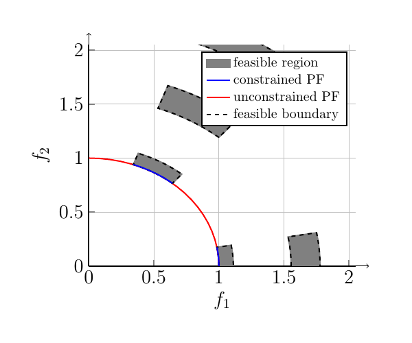

===============  
DC-DTLZ
===============
Dfferrent from C-DTLZ benchmark suite, in which the constriants act on the objective space, DC-DTLZ benchmark suite, developed in this paper, have constraints act on the decision space.

Type-1 Constrained Problems
-------------------------------
The constrained problems aim to introduce several infeasible segments on the PF. DC1-DTLZ1 and DC1-DTLZ3 have the same objective functions as C1-DTLZ1 and C1-DTLZ3.

DC1-DTLZ1
~~~~~~~~~~

the form of DC1-DTLZ1
#####################
  .. math:: 
    \mbox{min} f_1(x)&= \frac{1}{2}x_1x_2\dots x_{m-1}(1+g(x_m))\\
    \mbox{min} f_2(x)&= \frac{1}{2}x_1x_2\dots (1-x_{m-1})(1+g(x_m))\\
    \dots\\ 
    \mbox{min} f_{m-1}(x)&= \frac{1}{2}x_1(1-x_2)(1+g(x_m))\\
    \mbox{min} f_m(x)&= \frac{1}{2}(1-x_1)(1+g(x_m))

where

  .. math::
    g(x_m)=100[|x_m|+\sum_{x_i\in x_m}(x_i - 0.5)^2 - cos(20\pi(x_i -0.5))]   

:math:`x_m=(x_m, \dots, x_n)^T`. The constraints is defined as:

  .. math::
    c(x)=cos(a\pi *x_1)>b

a controls the number of feasible segments on the PF. b controls the size of each feasible segment, where a large b leads to a narrow feasible segment. In general, we set a =3, b=0.5.

Code
######

.. code-block:: c
   
    void dc1dtlz1 (individual_real *ind){
        int i, j, k, aux;
        double a, b;    // parameters of constraints
        double gx, re;
        double *xreal, *obj;

        obj   = ind->obj;
        xreal = ind->xreal;

        gx = 0.0;
        k  = number_variable - number_objective + 1;
        for (i = number_variable - k; i < number_variable; i++)
            gx += pow ((xreal[i] - 0.5), 2.0) - cos(20.0 * PI * (xreal[i] - 0.5));
        gx = 100.0 * (k + gx);

        for (i = 0; i < number_objective; i++)
            obj[i] = (1.0 + gx) * 0.5;

        for (i = 0; i < number_objective; i++)
        {
            for (j = 0; j < number_objective - (i + 1); j++)
                obj[i] *= xreal[j];
            if (i != 0)
            {
                aux     = number_objective - (i + 1);
                obj[i] *= 1 - xreal[aux];
            }
        }

        a  = 3;
        b  = 0.5;
        re = cos (a * PI * xreal[0]) - b;

        if (re > 0)
            re = 0;

        ind->cv = re;
    }

objective space view
########################

DC1-DTLZ3
~~~~~~~~~~

the form of DC1-DTLZ3
#####################
  .. math:: 
    \mbox{min} f_1(x)&=(1+g(x_m))cos(x_1\pi/2)\dots cos(x_{m-2}\pi/2)cos(x_m\pi/2)\\
    \mbox{min} f_2(x)&=(1+g(x_m))cos(x_1\pi/2)\dots cos(x_{m-2}\pi/2)sin(x_m\pi/2)\\
    \mbox{min} f_3(x)&=(1+g(x_m))cos(x_1\pi/2)\dots sin(x_{m-2}\pi/2)\\
    \dots\\
    \mbox{min}f_m(x)&=(1+g(x_m))sin(x_1\pi/2)\\

where

  .. math::
    g(x_m)=100[|x_m|+\sum_{x_i\in x_m}(x_i - 0.5)^2 - cos(20\pi(x_i -0.5))]   

:math:`x_m=(x_m, \dots, x_n)^T`. The constraints is defined as:

  .. math::
    c(x)=cos(a\pi *x_1)>b

In general, we set a =3, b=0.5.

Code
######

.. code-block:: c
   
    void dc1dtlz3 (individual_real *ind){
        int i, j, k, aux;

        double gx, fsum, re;
        double *xreal, *obj;

        obj   = ind->obj;
        xreal = ind->xreal;

        gx = 0.0;
        k  = number_variable - number_objective + 1;
        for (i = number_variable - k; i < number_variable; i++)
            gx += pow((xreal[i] - 0.5), 2.0) - cos(20.0 * PI * (xreal[i] - 0.5));
        gx = 100.0 * (k + gx);

        for (i = 0; i < number_objective; i++)
            obj[i] = 1.0 + gx;
    
        for (i = 0; i < number_objective; i++)
        {
            for (j = 0; j < number_objective - (i + 1); j++)
                obj[i] *= cos(PI * 0.5 * xreal[j]);
            if (i != 0)
            {
                aux     = number_objective - (i + 1);
                obj[i] *= sin(PI * 0.5 * xreal[aux]);
            }
        }

        double a = 3;
        double b = 0.5;
        re = cos(a*PI*xreal[0])-b;

        if (re > 0) re = 0;
        ind->cv = re;

        return;
    }

objective space view
########################

Type-2 Constrained Problems
-------------------------------
The constrained problems introduced have the same PF as the baseline test problems. DC2-DTLZ1 and DC2-DTLZ3 have the same objective functions as C1-DTLZ1 and C1-DTLZ3.

DC2-DTLZ1
~~~~~~~~~~

the form of DC2-DTLZ1
#####################
  .. math:: 
    \mbox{min} f_1(x)&= \frac{1}{2}x_1x_2\dots x_{m-1}(1+g(x_m))\\
    \mbox{min} f_2(x)&= \frac{1}{2}x_1x_2\dots (1-x_{m-1})(1+g(x_m))\\
    \dots\\ 
    \mbox{min} f_{m-1}(x)&= \frac{1}{2}x_1(1-x_2)(1+g(x_m))\\
    \mbox{min} f_m(x)&= \frac{1}{2}(1-x_1)(1+g(x_m))

where

  .. math::
    g(x_m)=100[|x_m|+\sum_{x_i\in x_m}(x_i - 0.5)^2 - cos(20\pi(x_i -0.5))]   

:math:`x_m=(x_m, \dots, x_n)^T`. The constraints is defined as:

  .. math::
    c_1(x)&=cos(a\pi *g(x_m))>b\\
    c_2(x)&=e^{-g(x_m)}>b

a controls the number of feasible segments on the PF. b controls the size of each feasible segment, where a large b leads to a narrow feasible segment. In general, we set a =3, b=0.9.

Code
######

.. code-block:: c
   
    void dc2dtlz1 (individual_real *ind){
        int i, j, k, aux;
        double gx, re;
        double *xreal, *obj;

        obj   = ind->obj;
        xreal = ind->xreal;

        gx = 0.0;
        k  = number_variable - number_objective + 1;
        for(i = number_variable - k; i < number_variable; i++)
            gx += pow((xreal[i] - 0.5), 2.0) - cos(20.0 * PI * (xreal[i] - 0.5));
        gx = 100.0 * (k + gx);

        for (i = 0; i < number_objective; i++)
            obj[i] = (1.0 + gx) * 0.5;

        for (i = 0; i < number_objective; i++)
        {
            for (j = 0; j < number_objective - (i + 1); j++)
                obj[i] *= xreal[j];
            if (i != 0)
            {
                aux     = number_objective - (i + 1);
                obj[i] *= 1 - xreal[aux];
            }
        }

        double b = 0.9;
        double a = 3;

        re = cos (gx / 100 * PI * a) - b;
        if (exp (-gx / 100) - b < re)
            re = exp (-gx / 100) - b;
        if (re > 0) re = 0;
        else re = re;

        ind->cv = re;
    }

objective space view
########################

.. figure:: ../_static/DCDTLZ/dc2dtlz1.png

DC2-DTLZ3
~~~~~~~~~~

the form of DC2-DTLZ3
#####################
  .. math:: 
    \mbox{min} f_1(x)&=(1+g(x_m))cos(x_1\pi/2)\dots cos(x_{m-2}\pi/2)cos(x_m\pi/2)\\
    \mbox{min} f_2(x)&=(1+g(x_m))cos(x_1\pi/2)\dots cos(x_{m-2}\pi/2)sin(x_m\pi/2)\\
    \mbox{min} f_3(x)&=(1+g(x_m))cos(x_1\pi/2)\dots sin(x_{m-2}\pi/2)\\
    \dots\\
    \mbox{min}f_m(x)&=(1+g(x_m))sin(x_1\pi/2)\\

where

  .. math::
    g(x_m)=100[|x_m|+\sum_{x_i\in x_m}(x_i - 0.5)^2 - cos(20\pi(x_i -0.5))]   

:math:`x_m=(x_m, \dots, x_n)^T`. The constraints is defined as:

  .. math::
    c_1(x)&=cos(a\pi *g(x_m))>b\\
    c_2(x)&=e^{-g(x_m)}>b

In general, we set a =3, b=0.9.

Code
######

.. code-block:: c
   
    void dc2dtlz3 (individual_real *ind){
        int i, j, k, aux;

        double gx, fsum, re;
        double *xreal, *obj;

        obj   = ind->obj;
        xreal = ind->xreal;

        gx = 0.0;
        k  = number_variable - number_objective + 1;
        for (i = number_variable - k; i < number_variable; i++)
            gx += pow((xreal[i] - 0.5), 2.0) - cos(20.0 * PI * (xreal[i] - 0.5));
        gx = 100.0 * (k + gx);

        for (i = 0; i < number_objective; i++)
            obj[i] = 1.0 + gx;
    
        for (i = 0; i < number_objective; i++)
        {
            for (j = 0; j < number_objective - (i + 1); j++)
                obj[i] *= cos(PI * 0.5 * xreal[j]);    
            if (i != 0)
            {
                aux     = number_objective - (i + 1);
                obj[i] *= sin (PI * 0.5 * xreal[aux]);
            }
        }

        double b = 0.9;
        double a = 3;

        re = cos (gx / 100 * PI * a) - b;
        if (exp (-gx / 100) - b < re)
            re = exp (-gx / 100) - b;
        if (re > 0) re = 0;
        else re = re;

        ind->cv = re;
    }

objective space view
########################

Type-3 Constrained Problems
-------------------------------
This type of constrained problem is a combination of Type-1 and Type-2 constriants. The objective functions of DC3-DTLZ1 and DC3-DTLZ3 are the same as C1-DTLZ1 and C1-DTLZ3.

DC3-DTLZ1
~~~~~~~~~~

the form of DC3-DTLZ1
#####################
  .. math:: 
    \mbox{min} f_1(x)&= \frac{1}{2}x_1x_2\dots x_{m-1}(1+g(x_m))\\
    \mbox{min} f_2(x)&= \frac{1}{2}x_1x_2\dots (1-x_{m-1})(1+g(x_m))\\
    \dots\\ 
    \mbox{min} f_{m-1}(x)&= \frac{1}{2}x_1(1-x_2)(1+g(x_m))\\
    \mbox{min} f_m(x)&= \frac{1}{2}(1-x_1)(1+g(x_m))

where

  .. math::
    g(x_m)=100[|x_m|+\sum_{x_i\in x_m}(x_i - 0.5)^2 - cos(20\pi(x_i -0.5))]   

:math:`x_m=(x_m, \dots, x_n)^T`. The constraints is defined as:

  .. math::
    c_j(x)&=cos(a\pi *x_j)>b, \forall j=1,\dots, m. \\
    c_{m+1}(x)&=cos(a\pi g(x_m))>b

a controls the number of feasible segments on the PF. b controls the size of each feasible segment, where a large b leads to a narrow feasible segment. In general, we set a =3, b=0.5.

Code
######

.. code-block:: c
   
    void dc3dtlz1 (individual_real *ind){
        int i, j, k, aux;
        double a, b;    // parameters of constraints
        double gx, re;
        double *xreal, *obj;

        obj   = ind->obj;
        xreal = ind->xreal;

        gx = 0.0;
        k  = number_variable - number_objective + 1;
        for (i = number_variable - k; i < number_variable; i++)
            gx += pow((xreal[i] - 0.5), 2.0) - cos(20.0 * PI * (xreal[i] - 0.5));
        gx = 100.0 * (k + gx);
    
        for (i = 0; i < number_objective; i++)
            obj[i] = (1.0 + gx) * 0.5;
    
        for (i = 0; i < number_objective; i++)
        {
            for (j = 0; j < number_objective - (i + 1); j++)
                obj[i] *= xreal[j];
            if (i != 0)
            {
                aux     = number_objective - (i + 1);
                obj[i] *= 1 - xreal[aux];
            }
        }

        a = 3;
        b = 0.5;

        re = cos (a * PI * gx) - b;

        for (i = 0; i < number_variable - k; i++)
        {
            if (cos(a * PI * xreal[i]) - b < re)
                re = cos (a * PI * xreal[i]) - b;
        }

        if (re > 0) re = 0;

        ind->cv = re;
    }

objective space view
########################

DC3-DTLZ3
~~~~~~~~~~

the form of DC3-DTLZ3
#####################
  .. math:: 
    \mbox{min} f_1(x)&=(1+g(x_m))cos(x_1\pi/2)\dots cos(x_{m-2}\pi/2)cos(x_m\pi/2)\\
    \mbox{min} f_2(x)&=(1+g(x_m))cos(x_1\pi/2)\dots cos(x_{m-2}\pi/2)sin(x_m\pi/2)\\
    \mbox{min} f_3(x)&=(1+g(x_m))cos(x_1\pi/2)\dots sin(x_{m-2}\pi/2)\\
    \dots\\
    \mbox{min}f_m(x)&=(1+g(x_m))sin(x_1\pi/2)\\

where

  .. math::
    g(x_m)=100[|x_m|+\sum_{x_i\in x_m}(x_i - 0.5)^2 - cos(20\pi(x_i -0.5))]   

:math:`x_m=(x_m, \dots, x_n)^T`. The constraints is defined as:

  .. math::
    c_1(x)&=cos(a\pi *g(x_m))>b\\
    c_2(x)&=e^{-g(x_m)}>b

In general, we set a =3, b=0.5.

Code
######

.. code-block:: c
   
    void dc3dtlz3 (individual_real *ind){
        int i, j, k, aux;
        double a, b;    // parameters of constraints
        double gx, fsum, re;
        double *xreal, *obj;

        obj   = ind->obj;
        xreal = ind->xreal;

        gx = 0.0;
        k  = number_variable - number_objective + 1;
        for (i = number_variable - k; i < number_variable; i++)
            gx += pow ((xreal[i] - 0.5), 2.0) - cos (20.0 * PI * (xreal[i] - 0.5));
        gx = 100.0 * (k + gx);
    
        for (i = 0; i < number_objective; i++)
            obj[i] = 1.0 + gx;

        for (i = 0; i < number_objective; i++)
        {
            for (j = 0; j < number_objective - (i + 1); j++)
                obj[i] *= cos (PI * 0.5 * xreal[j]);
            if (i != 0)
            {
                aux     = number_objective - (i + 1);
                obj[i] *= sin (PI * 0.5 * xreal[aux]);
            }
        }

        a  = 3;
        b  = 0.5;

        re = cos (a * PI * gx) - b;
        for (i = 0; i < number_variable - k; i++)
        {
            if (cos (a * PI * xreal[i]) - b < re)
                re = cos (a * PI * xreal[i]) - b;
        }

        if (re > 0) re = 0;

        ind->cv = re;
    }

objective space view
########################

